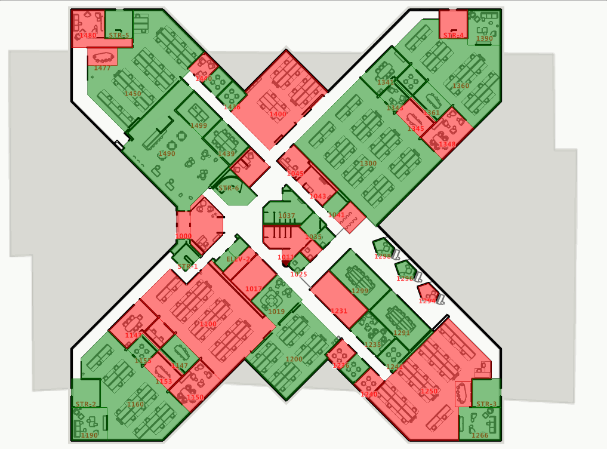
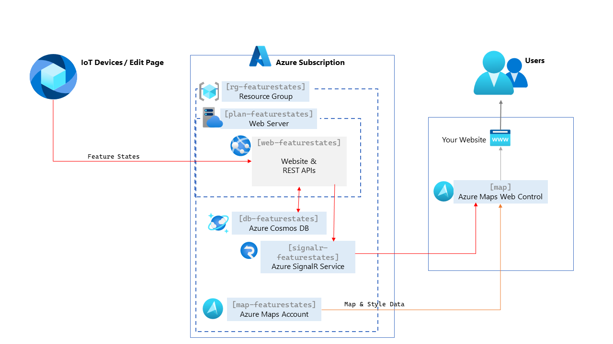

# Azure Maps Custom Feature States

Welcome to the Azure Maps Custom Feature States starter project! Enhance your indoor maps with real-time styling of map features - 
if you're monitoring occupancy statuses, crowd levels, room temperatures, air quality or similar, this project will give you a starting point to get set up.



## Motivation

The Azure Maps Custom Feature States project provides a set of back-end services as well as a front-end sample for styling Azure Maps map features in **real-time** based on updates received from external sources. 

Although this functionality is natively supported by the Creator Indoor Maps API
via the built-in [feature stateset](https://learn.microsoft.com/en-us/azure/azure-maps/how-to-creator-feature-stateset) capability, this project **does not use this offering**. Instead, the associated functionality is implemented externally  using the [`setFeatureState` API](https://learn.microsoft.com/en-us/javascript/api/azure-maps-control/atlas.sourcemanager?view=azure-maps-typescript-latest#azure-maps-control-atlas-sourcemanager-setfeaturestate) on the browser. Depending on your use-case, this design may allow for faster update latency, greater flexibility and lower costs.

This project may be of interest to you if:

- You are the application owner of a kiosk/dashboard/monitor based on Azure Indoor Maps and wish to visualize dynamic properties of map features - such as IoT telemetry or room occupancies.
- You have either of the following requirements that make the built-in feature stateset capability of Creator Indoor Maps unsuitable for you:
  - You'd like these updates to be visualized in real-time (desired updated latency between 1 and 30 seconds). 
  - Your estimated financial costs of receiving updates on the front-end (via repeated [feature state transactions](https://learn.microsoft.com/en-us/azure/azure-maps/understanding-azure-maps-transactions)) are too high. 

## Getting Started in 15 Minutes

Getting started is easy! If you're not a developer, follow these simple steps:

1. **Azure Subscription**: Ensure you have an Azure subscription. If not, sign up for a free Azure subscription [here](https://azure.microsoft.com/free).

2. **PowerShell 7**: Install PowerShell 7 from [here](https://learn.microsoft.com/en-us/powershell/scripting/install/installing-powershell-on-windows?view=powershell-7.3).

3. **Azure Command-Line Interface (CLI) Tools**: Install the Azure CLI by following the instructions [here](https://docs.microsoft.com/en-us/cli/azure/install-azure-cli). Learn how to sign in [here](https://learn.microsoft.com/en-us/cli/azure/authenticate-azure-cli-interactively).
   ```powershell
   az login
   ```

5. **Deployment script**: Run this PowerShell command (copy and paste) to install the Azure Maps Custom Feature States project:
    ```powershell
    iex (iwr "https://samples.azuremaps.com/customfeaturestates/deploy.ps1").Content
    ```
    **Note** that you may need to change some of the script parameters for your use-case; learn how to do this by running this command:
    ```powershell
    iwr "https://samples.azuremaps.com/customfeaturestates/deploy.ps1" -OutFile deploy.ps1
    .\deploy.ps1 -Help
    ```

The output should look similar to the following:

```txt
Starting...
- Logs written to C:\Logs\customfeaturestates_deploy.tsv
- Assuming Azure maps geography 'eu' based on location 'westeurope', geography 'Europe'
- Creating a Resource Group named 'rg-featurestates' in the 'westeurope' location...
- Creating an Azure Maps account named 'map-featurestates'...
- Creating an Azure Maps creator account named 'mapcreator-featurestates'...
- Uploading drawing package using creator account from 'https://github.com/Azure-Samples/am-creator-indoor-data-examples/raw/master/Drawing%20Package%202.0/Sample%20-%20Contoso%20Drawing%20Package.zip' to 'https://eu.atlas.microsoft.com'...
- This operation may take several minutes; please wait...
- Modifying map style with custom feature state rules...
- Creating an Azure SignalR service named 'signalr-featurestates1951821260'...
- Creating an Azure Cosmos DB server named 'db-featurestates1951821260'...
- Creating a database named 'featurestatesdb'...
- Creating a Webserver plan named 'plan-featurestates' for the Website 'web-featurestates1951821260'...
- Utilizing managed identities for Azure Maps...
- Assigning Azure Maps Data Reader role to principal and current user...
- Creating an Azure AD App registration...
- Storing App Settings...
- Writing dev config to .\FeatureStateService\appsettings.Development.json...
- Initiating the deployment of the Custom Feature States website...
- Downloading deployment zip...
Azure Resources created: rg-featurestates, signalr-featurestates1951821260, map-featurestates, mapcreator-featurestates, db-featurestates1951821260, plan-featurestates, web-featurestates1951821260
Azure Maps resources created: udId: c9e77565-4b35-9bd5-e178-3389f1c8b7f1, conversionId: bc066103-a810-78b1-ffa0-2b2aa01b75d6, datasetId: ea667ec5-0f7a-6342-adec-f8ea3b60bf6a, tilesetId: 116fc015-35b4-3239-3bd2-7730dd8f165c, mapConfigurationId: default_116fc015-35b4-3239-3bd2-7730dd8f165c
Open https://web-featurestates1520156901.azurewebsites.net/ to access your website.
Done! Your Azure Maps Custom Feature States infrastructure and website are ready.
```

## Developers

If you're a developer looking to dig into the internals of the code and adapt it to the needs of your project, you'll need to set up your developer environment as below.

### Pre-requisites

1. **Azure Subscription**: Sign up for a free Azure subscription [here](https://azure.microsoft.com/free).

2. **.NET 8 Framework**: Install the .NET 8 framework from [dot.net](https://dot.net/).

3. **PowerShell 7**: Install PowerShell 7 from [here](https://learn.microsoft.com/en-us/powershell/scripting/install/installing-powershell-on-windows?view=powershell-7.3).

4. **Azure Command-Line Interface (CLI) Tools**: Install the Azure CLI by following the instructions [here](https://docs.microsoft.com/en-us/cli/azure/install-azure-cli). Learn how to sign in [here](https://learn.microsoft.com/en-us/cli/azure/authenticate-azure-cli-interactively).

5. **Visual Studio 2022**: Download and install Visual Studio 2022 from [visualstudio.microsoft.com](https://visualstudio.microsoft.com/).

### Project Setup

Follow these steps to get started with the Azure Maps Custom Feature States project:

#### Azure Infrastructure

1. Clone the project from GitHub.
2. Run the PowerShell script `.\deploy.ps1`. This script sets up the initial Azure services required for this project.
3. Review the [architecture diagram](Images/Architecture.png) to understand what will be created.



#### Component Overview
1. `rg-featurestates` - An [Azure Resource Group](https://learn.microsoft.com/en-us/azure/azure-resource-manager/management/manage-resource-groups-portal) that holds all the created Azure resources in the architecture.
2. `plan-featurestates` - An [Azure App Service plan](https://learn.microsoft.com/en-us/azure/app-service/overview-hosting-plans) that hosts the `web-featurestates` app.
3. `web-featurestates` - An [Azure App Service](https://learn.microsoft.com/en-us/azure/app-service/overview) website and API with the following functionality:
   1. Serves web-pages containing the [Azure Maps Web Control](https://learn.microsoft.com/en-us/azure/azure-maps/how-to-use-map-control).
   2. Sends a snapshot of current feature states to web-pages containing the Web Control via SignalR.
   3. Hosts a REST API to receive feature state updates from external sources and propagates these updates to other components.
4. `signalr-featurestates` - An [Azure SignalR Service](https://learn.microsoft.com/en-us/azure/azure-signalr/signalr-overview) that sends feature states snapshots and broadcasts updates over a real-time channel to web-pages containing the Web Control.
5. `db-featurestates` - An [Azure Cosmos DB](https://learn.microsoft.com/en-us/azure/cosmos-db/introduction) that persists latest values of feature states, allowing the app service to be restarted without data loss.
6. `map-featurestates` - An [Azure Maps account](https://learn.microsoft.com/en-us/azure/azure-maps/how-to-manage-account-keys) that hosts all static map data for the styled map.

#### Developer Environment

Next, you'll need to be able to run a development web server from within Visual Studio to be able to modify and debug code.

Launch the `CustomFeatureStates` solution file in Visual Studio. Notice the existence of an `appsettings.json` configuration file as well as an `appsettings.development.json` file that is only used in the developer environment.

#### Run the Custom Feature States Application

1. In the Azure Portal, add the URL `https://localhost:7239` to the CORS list for the website and Azure Maps.

2. Run the `FeatureStateService` project to see the application in action.

#### Deploy the Custom Feature States Application

To be able to push your code changes to the live environment, you'll need to create a Publish profile.

1. From Visual Studio, right-click on the `FeatureStateService` project and click **Publish**.

2. Click **New Profile**, then choose **Target -> Azure** and click **Next**.

3. Choose **Specific target -> Azure App Service (Windows)** and click **Next**.

4. Choose **App Service -> [your_app_service_from_above]** and click **Next**.

5. Choose **Deployment type -> Publish (generates pubxml file)** and click **Finish**.

6. You've now created a Publish profile and can push your changes whenever you like by clicking the **Publish** button.

#### Common Points of Customization

1. **Using your own map**
   - If you have your map available as a drawing package URI, you may use the `-DrawingPackageUri` parameter of the deployment script. Otherwise, replace the following lines of the script to point to your local package file.

      ```powershell
      $packageFilePath = GetTempFile("drawing_package_$Name.zip")
      Invoke-WebRequest "$azuremapsDrawingPackageUri" -OutFile $packageFilePath
      ```
   - If the features you'd like to style are in a different layer than `indoor_room_area`, change the `$azureMapsFeatureLayer` variable of the deployment script.
   - If you have an existing map account you'd like to use, change the `$azuremaps` and `$azuremapsCreator` variables of the deployment script.
   - If you have an existing map you'd like to use, also change the `# Upload package` section of the deployment script to ensure that the `$datasetId`, `$tilesetId` and `$mapConfigurationId` variables are set correctly. Note that the deployment script will always create a modified map-configuration with dynamic styling rules.

2. **Using your own styling rules** - Change the following section of the deployment script, which controls the [fillColor](https://learn.microsoft.com/en-us/javascript/api/azure-maps-control/atlas.polygonlayeroptions?view=azure-maps-typescript-latest#azure-maps-control-atlas-polygonlayeroptions-fillcolor) of styled features:

  ```powershell
    $azureMapsFeatureStatesToColor = @{"free"="green"; "occupied"="red"}
    $azureMapsDefaultFeatureColor = "white"
  ```

For a more interactive experience, you may wish to use the [Azure Maps Style Editor](https://azure.github.io/Azure-Maps-Style-Editor) - remember to update the `AzureMaps:MapConfigurationId` environment variable of the `web-featurestates` service once you're done.

  You may also wish to modify this section of the `appsettings.json` file, which is used as a hint on the "Edit Features" page of the website:

  ```json
    "EditFeatureStates": {
      "FeatureStates": ["free", "occupied"]
    },
  ```

3. **Pushing your own feature state updates** - Get your IoT devices / data-sources to send their updates to the exposed REST endpoint (e.g. in the developer environment https://localhost:7239/api/featurestates). For example:

```javascript
const saveData = {
    id: 'example_id',
    value:'example_value',
};

$.ajax({
    type: 'POST',
    url: '/api/featurestates',
    contentType: 'application/json',
    data: JSON.stringify(saveData)
  });
 ``` 

 4. **Using your own authorization rules** - Modify this section of `Program.cs`:

```cs
var policy = new AuthorizationPolicyBuilder()
            .RequireAuthenticatedUser() // add more rules here if needed
            .Build();
```

Thank you for your interest in this project! We are actively working to improve and enhance it. If you encounter any issues or have suggestions, please feel free to contribute or reach out to us. Happy coding!
